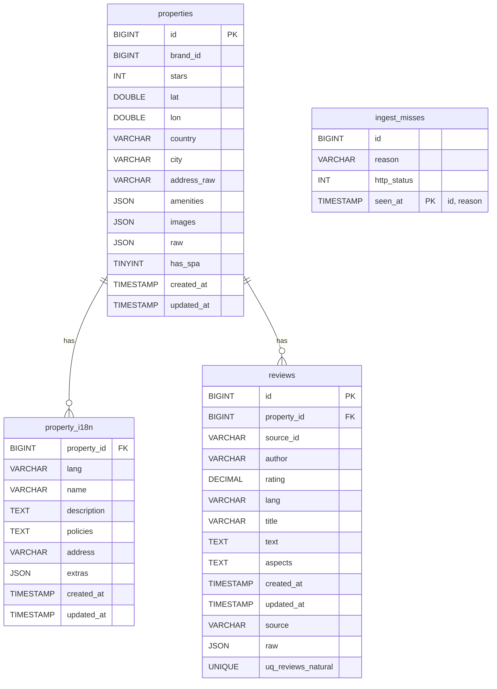

# Cupid Hotel Backend — Submission Pack

A compact, single-document guide that reviewers can follow end-to-end. It includes: **clear run instructions, API docs (OpenAPI), database schema (ERD), testing, and data-sync strategy**.

> ✅ This README assumes Docker Desktop + Compose v2 and Go ≥ 1.21. No secrets are included—use your own `.env`.

---

## 1) Project Overview

This service ingests hotel **properties**, **reviews**, and **translations (fr, es)** from the Cupid API, stores normalized data in MySQL, caches hot reads in Redis, and exposes a small, well-documented HTTP API.

**Key traits**

* Robust ingestion with retry/backoff + limited concurrency
* Compatibility-first MySQL schema with JSON columns for raw payloads
* Cached read-paths (Redis) + simple ETag support on endpoints
* OpenAPI 3.1 spec shipped in-repo (`api/openapi.yaml`)
* Dockerized local stack (MySQL, Redis, API, Ingestor)
* Clean architecture guided by **Domain-Driven Design (DDD)** and **SOLID principles**

**High-level architecture**

* **Adapters:** Cupid client (HTTP + rate limit + retries), HTTP server, Redis cache, metrics/logging
* **App layer:** command/query services; mapping from messy upstream JSON to normalized domain types
* **Storage:** MySQL repository (upserts + pagination), migrations

Repo layout (abridged):

```
cmd/api               # HTTP server
cmd/ingestor          # Batch/property ingestor
internal/adapters     # cupid client, http server, redis, observability
internal/app          # commands/queries + mappers
internal/domain       # ports (interfaces) & entities
internal/storage/mysql# repo + SQL + migrations
internal/shared       # fixtures and helpers
api/openapi.yaml      # OpenAPI spec
```

---

## 2) Running Locally (Fast Path)

### A. Create your `.env` (do **not** commit secrets)

```env
APP_ENV=dev
HTTP_ADDR=:8080
METRICS_ADDR=:9100

# MySQL
MYSQL_ROOT_PASSWORD=root
MYSQL_DATABASE=cupid
MYSQL_USER=app
MYSQL_PASSWORD=app
MYSQL_DSN=app:app@tcp(mysql:3306)/cupid?parseTime=true&multiStatements=true&charset=utf8mb4,utf8&loc=UTC

# Redis
REDIS_ADDR=redis:6379
REDIS_DB=0
REDIS_PASSWORD=

# Cupid API
CUPID_BASE_URL=https://content-api.cupid.travel/v3.0
CUPID_API_KEY=your-api-key

# Ingestor
INGEST_WORKERS=8
INGEST_REVIEW_COUNT=200
```

### B. Start the stack

Using the Makefile (recommended):

```bash
make up
make migrate
make ingest
```

Check containers:

```bash
make ps
make logs
```

> MySQL container port `3306` is mapped to host `3307`.

Without Make:

```bash
docker compose -f docker/compose.yml up -d mysql redis
docker compose -f docker/compose.yml run --rm ingestor
docker compose -f docker/compose.yml up -d api
```

### C. Quick smoke test

```bash
curl -s http://localhost:8080/healthz
curl -s "http://localhost:8080/v1/hotels/1641879?lang=fr" | jq
curl -s "http://localhost:8080/v1/hotels/898052?lang=fr" \
  | jq '{ID, Name, City, Country, Language}'
curl -s "http://localhost:8080/v1/hotels/1617655/reviews?limit=3" \
  | jq '.Items'

```

---

## 3) API Documentation (OpenAPI)

The OpenAPI 3.1 spec is at **`api/openapi.yaml`**.

Use Swagger Editor, Redocly (`npx @redocly/cli preview-doc api/openapi.yaml`), or host via Swagger UI.

**Endpoints**

* `GET /v1/hotels/{id}` — localized (via `?lang=fr|es` or `Accept-Language`)
* `GET /v1/hotels/{id}/reviews` — newest-first, with `limit` (default 50, max 200)
* `GET /healthz` — liveness
* `GET /metrics` — Prometheus metrics (port 9100)

---

## 4) Database Schema (ER diagram)

Defined in `internal/storage/mysql/migrations`.

Core tables: `properties`, `property_i18n`, `reviews`, `ingest_misses`.

ERD:



---

## 5) Testing & Coverage

**Unit tests**

```bash
make test
```

**Integration tests**

```bash
make itest
```

Runs Go tests against MySQL in Docker. Ensure containers are up.

> For submission, attach `go test -v ./...` output as **Testing Results**.

---

## 6) Data Sync Strategy

* Initial backfill with ingestor workers
* Incremental sync via `updated_at` / ETag hints from upstream
* Retry with backoff + jitter
* Dead-letter into `ingest_misses`
* Idempotent upserts (`ON DUPLICATE KEY`)
* Cache with Redis + ETags
* Hourly/daily scheduling

Optional: Kafka streams, Bloom filters for unseen review IDs.

---

## 7) Performance Notes

* Composite indexes for hot paths
* Pagination via cursors
* ETag + Redis caching
* Ingest bounded concurrency, avoid N+1

---

## 8) Observability

* Logs: zerolog
* Metrics: Prometheus at `/metrics`
* Health: `/healthz`

---

## 9) Submission Checklist

* ✅ Repo contains `.env.example`, not secrets
* ✅ ERD (Mermaid block here, PNG optional)
* ✅ OpenAPI at `api/openapi.yaml`
* ✅ README (this file) in repo root
* ✅ Tests runnable (`make test`, `make itest`)

**Codebase:** [https://github.com/your-org/cupid-hotel](https://github.com/your-org/cupid-hotel)
**Swagger doc:** `api/openapi.yaml` (open in Swagger Editor)

---

## 10) Useful Make Targets

```
make nuke       # stop & remove volumes
make reset      # rebuild, apply migrations
make up         # start mysql, redis, api
make down       # stop all services
make migrate    # run migrations
make ingest     # run ingestor once
make verify     # DB sanity checks
make mysql      # mysql shell in container
make logs       # tail mysql logs
make ps         # list containers
make test       # unit tests
make itest      # integration tests
```

---

## 11) Security

* `.env.example` only, no real secrets
* Rotate API keys regularly
* Restrict MySQL to internal Docker network
* Use TLS & secret management in production

---

## 12) FAQ

**Q:** MySQL won’t accept connections on 3306 locally.
**A:** Use `127.0.0.1:3307` (Compose maps host 3307 → container 3306).

**Q:** How to regenerate API docs?
**A:** Edit `api/openapi.yaml`; preview with Swagger Editor or Redocly.

**Q:** Where are property IDs?
**A:** They’re defined in `internal/shared/fixtures.go` and used by the ingestor (`cmd/ingestor`).

---